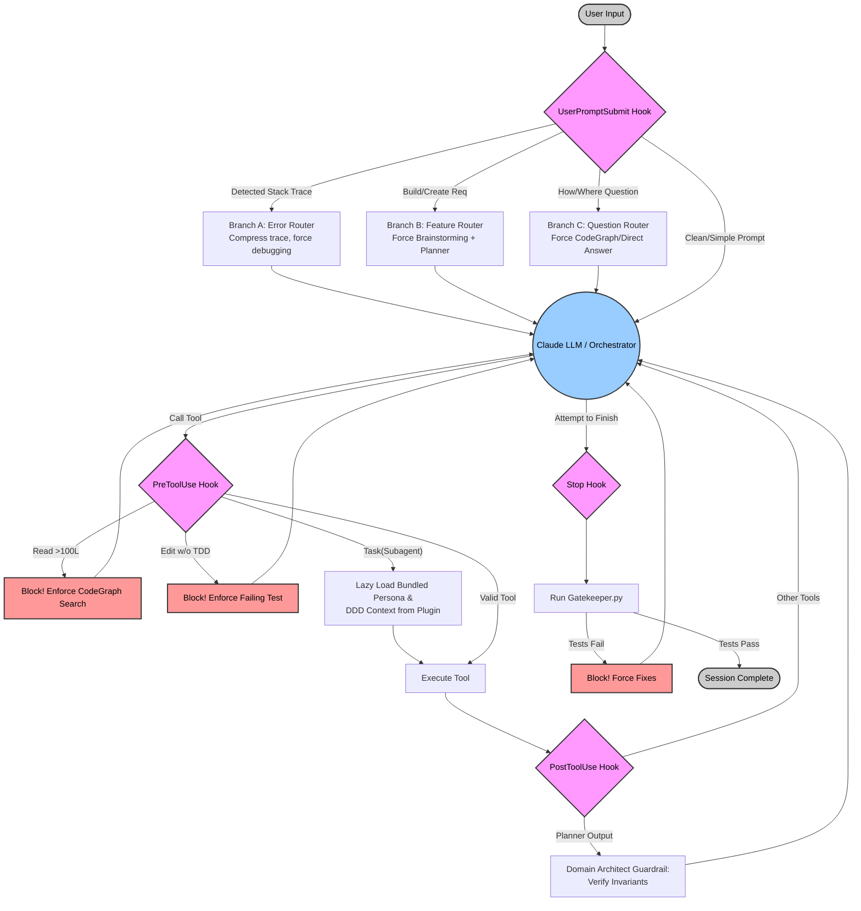

# Deterministic Plugin Hooks Design (V4: The Portable Harness)

**Date:** 2026-05-20  
**Status:** Final Approval  
**Scope:** Transforming the auto-generated Claude Code plugin into a self-contained, portable unit that bundles the entire project harness (Agents, Skills, Rules, and Hooks) into a single installable package.

## Problem Statement

The previous design treated the plugin as a "bridge" to live files in the workspace. While this ensured live updates, it failed the "Packaging & Portability" mental model. A true Claude Code plugin should be the **container** for knowledge and logic. 

Furthermore, the initial "Harness Minting" phase (copying boilerplate) and the "Plugin Generation" phase were disconnected, creating a risk where the plugin lacked the full context of the synthesized agents (like the `@domain-sme`) and lobotomized complex skills that rely on external scripts.

Finally, there was a technical mismatch in how hooks were invoked: the generated manifest defined command hooks, but the generated source files were modules requiring package context, leading to execution failures.

## Goal

Create a **Zero-Config Portable Harness**. When a user selects "Claude Code" during `harness-wf init`, the system will:
1.  Mint the base harness.
2.  **Deep Migrate** the entire `boilerplate-agent/` and `harness/` logic into a self-contained plugin folder, preserving all scripts and templates.
3.  Include all 5 Deterministic Hooks (executable natively) to enforce the Hub-and-Spoke model.
4.  Implement active **Matrix Routing** in the hooks to bypass LLM thinking steps.
5.  Automate CodeGraph onboarding so the plugin is ready for high-performance codebase navigation immediately.

---

## The Self-Contained Architecture

The plugin folder (`.claude/plugin-generated/`) now owns the entire project intelligence.

```text
.claude/plugin-generated/
├── .claude-plugin/
│   ├── plugin.json                # Tools & Hook definitions (using first-class dynamic tools)
│   └── marketplace.json           # Local installation manifest
├── src/
│   ├── hooks/                     # Executable hook scripts (e.g., prompt_interceptor.py)
│   ├── tools.py                   # Handlers for dynamically registered skill tools and Task()
│   └── dispatcher.py              # Orchestrator routing logic & Matrix classification
├── agents/                        # Bundled subagent .md files
│   ├── implementer.md
│   ├── planner.md
│   └── domain-sme.md              # Synthesized during init
├── skills/                        # Deep-copied procedural workflows (including scripts/templates)
│   ├── systematic-debugging/
│   ├── brainstorming/
│   │   ├── SKILL.md
│   │   └── scripts/               # Preserved execution scripts
│   └── test-driven-development/
└── config/                        # Project-specific context
    ├── ddd-context.json           # Live DDD invariants
    └── rules.json                 # Core mandates
```

---

## Architectural Lifecycle Diagram (The Deterministic Loop)



---

## Technical Revisions for V4 Implementation

To ensure perfect integration with the harness, the following technical shifts from V3 are required:

1.  **Hook Execution Model:** 
    *   Instead of generating a generic `src/interceptor.py` that relies on package imports (`from .orchestrator_plugin...`), hooks must be generated as **executable standalone scripts** in a dedicated `src/hooks/` directory (e.g., `src/hooks/prompt_interceptor.py`).
    *   The `plugin.json` manifest must register these correctly as `command` type hooks, ensuring they can execute in isolation without PYTHONPATH issues.
2.  **Deep Copy Migration:** 
    *   `plugin_generator.py` must perform a recursive file tree copy (`shutil.copytree`) for the `skills/` and `agents/` directories, rather than just extracting markdown text. This prevents "lobotomizing" skills like `brainstorming` that rely on nested `scripts/` or HTML templates.
3.  **Active Matrix Routing (The UPS Hook):** 
    *   The `UserPromptSubmit` hook must implement heuristic classification.
    *   It will analyze the user prompt and **inject hidden context**. For example, if a stack trace is detected (Branch A), the hook will prepend: `[ORCHESTRATOR ROUTE: BUG_FIX. SKIP PLANNING. USE SYSTEMATIC-DEBUGGING. GO STRAIGHT TO @IMPLEMENTER.]`
    *   It will also perform pre-emptive token compression (e.g., calling an `extract_stacktrace` utility) before passing the prompt to the LLM.
4.  **Dynamic Skill Tools:** 
    *   Instead of a single, generic `Skill` tool that requires the LLM to know the skill name, the manifest generator will scan the deep-copied `skills/` directory and dynamically generate first-class tools for each skill in `plugin.json` (e.g., `skill_tdd()`, `skill_brainstorming()`). This improves LLM discoverability and auto-completion.
5.  **CodeGraph Enforcement:** 
    *   The `initialize` hook (or post-install script) must verify the presence of the `codegraph` MCP server in the host configuration, prompting installation if missing, enforcing the "Graph-First" strategy.

---

## Unified Onboarding Flow

1.  **Mint Phase:** `harness-wf init` runs. It creates the project structure, downloads skills (with all their supporting files), and generates the `@domain-sme`.
2.  **Migration Phase:** `harness/plugin_generator.py` is called. It:
    *   **Deep copies** the `agents/` and `skills/` folders into the plugin structure.
    *   Generates standalone, executable hooks in `src/hooks/`.
    *   Injects the **Full Matrix Router** logic into `src/hooks/prompt_interceptor.py`.
    *   Dynamically registers each skill as a distinct tool in `plugin.json`.
3.  **Onboarding Phase:** The user runs `setup_harness.sh`. It:
    *   Builds the CodeGraph index.
    *   Automatically runs `/plugin marketplace add` and `/plugin install`.
    *   **Result:** The user opens Claude Code and the entire harness is "just there," enforcing TDD, protecting tokens, and routing accurately without brittle workspace dependencies.

---

## Business Value: The Token Efficient Enforcer

*   **Zero-Shot Routing:** By performing heuristic classification in Python (Branch A/B/C/D), we skip the LLM's expensive "thinking" turn entirely.
*   **Trace Compression:** Native Python compression of stack traces reduces input tokens by up to 90% for bug reports.
*   **Portable Knowledge:** The plugin is the "Knowledge Package". It ensures every subagent has immediate access to DDD Context and Invariants without the LLM needing to "find" them.
*   **Engineering Rigor:** Programmatic blocking of non-TDD edits and early success claims ensures high-quality outcomes with less manual oversight.