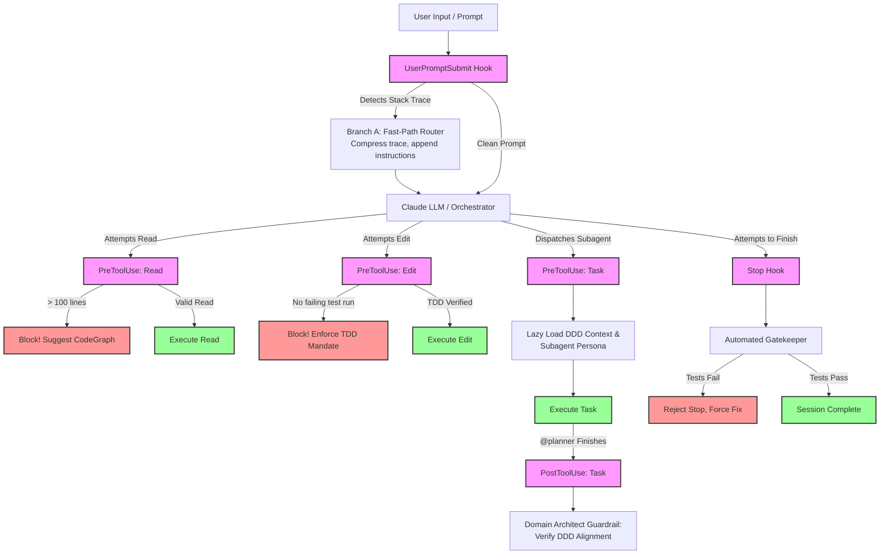

# Deterministic Plugin Hooks Design (V3: The Enforcer Matrix)

**Date:** 2026-05-20  
**Status:** Approved  
**Scope:** Enhancing the auto-generated Claude Code plugin to enforce deterministic harness behaviors via a comprehensive suite of Claude Code hooks (`UserPromptSubmit`, `PreToolUse`, `PostToolUse`, `Stop`).

## Problem Statement

The embedded harness currently relies on LLM compliance ("soft prompting") to follow instructions defined in `AGENTS.md` and `orchestrator.md`. While the generated Claude Code plugin successfully exposes the `Skill` and `Task` tools, it relies on the AI to "remember" to use them.

Relying on LLM reasoning for routing and discipline causes:
1. **Token Bloat**: The LLM must read large prompts, analyze intent, and output `<thinking>` blocks just to decide what to do.
2. **Brittle Guardrails**: The LLM easily forgets to write failing tests first (TDD) or reads massive files instead of using search tools.
3. **Loss of Determinism**: When a user pastes a stack trace, Claude often attempts to guess the fix immediately instead of systematically routing the issue to the proper debugging subagent.

## Goal

Create a "Perfect Harness" that translates markdown mandates into **executable Python code**. The plugin will act as an active, intelligent gateway that enforces the Hub-and-Spoke model, optimizes token usage, and guarantees engineering rigor—all without impeding the developer's natural workflow.

---

## Architectural Lifecycle Diagram

This diagram illustrates how the Python plugin intercepts Claude Code's native event lifecycle to enforce the harness deterministically.

---

## The 5 Deterministic Hooks

### 1. The "Branch A" Auto-Router (`UserPromptSubmit` Hook)
*   **Trigger**: Before the prompt hits the LLM.
*   **Logic**: Uses logic from `extract_stacktrace.py` to scan for error signatures (`panic:`, `Traceback`, etc.). 
*   **Action**: Compresses the error to save tokens. Appends a hidden system directive to the prompt:
    > *[ROUTING OVERRIDE]: Confirmed Bug Fix. Do not output an intent analysis. You MUST use `Skill("systematic-debugging")` and `Task("implementer")`.*
*   **Value**: Enables **Zero-Shot Routing**. Bypasses the LLM's slow decision matrix and forces immediate, correct delegation.

### 2. The Strict TDD Enforcer (`PreToolUse` Hook)
*   **Trigger**: When Claude tries to use the `Edit` tool.
*   **Logic**: If the target is a production file (`src/*.py`), checks the session history to see if `Bash` was recently used to run a test suite (and if it failed).
*   **Action**: Blocks the edit if the "Red" phase of TDD was skipped.
    > *[TDD MANDATE VIOLATION]: You must write and run a failing test before modifying production code.*
*   **Value**: Forces rigorous engineering standards programmatically.

### 3. The Golden Rule Token Protector (`PreToolUse` Hook)
*   **Trigger**: When Claude tries to use the `Read` tool.
*   **Logic**: Checks the size of the target file.
*   **Action**: If the file is massive (>100 lines) and the read is unbounded, blocks the tool.
    > *[CORE MANDATE VIOLATION]: File too large. Use `mcp_codegraph_codegraph_search` or `Grep` instead to protect your token window.*
*   **Value**: Physically prevents context window bloat, keeping the session fast and cheap.

### 4. The Domain Architect Guardrail (`PostToolUse` Hook)
*   **Trigger**: When the `@planner` task completes.
*   **Logic**: Intercepts the planner's output before the Orchestrator resumes.
*   **Action**: Evaluates the plan against the `CONTEXT.md` invariants (potentially triggering a fast, hidden LLM evaluation or AST check). If violated, pushes the task back to the planner with feedback.
*   **Value**: Ensures architectural integrity without manual human code review.

### 5. The Automated Gatekeeper (`Stop` Hook)
*   **Trigger**: When Claude attempts to finish a task and return control to the user.
*   **Logic**: Silently runs `scripts/gatekeeper.py` (which runs linters and tests).
*   **Action**: If tests fail, blocks the stop event and forces Claude to keep working.
    > *[GATEKEEPER REJECTION]: Build failed. You must fix these errors before completing the task.*
*   **Value**: Prevents premature success claims. The user never sees "I fixed it!" unless the fix actually passes tests.

---

## Business Value & Economics

### 1. Enabling the Matrix Routing Pattern
The plugin fundamentally shifts the Orchestrator's decision matrix from **Soft Prompts** to **Native Python Execution**. 
Instead of paying the LLM to read its own rules, output a `<thinking>` block, and slowly decide to dispatch a subagent, the Python hooks instantly evaluate the state (e.g., Is this an error? -> Branch A. Is this a feature? -> Branch B) and hardcode the path. 

### 2. Massive Token Savings
*   **Trace Compression**: Compressing a 1000-line Java stack trace to 40 lines in Python saves ~10,000 input tokens before the LLM even sees it.
*   **Lazy Loading**: We no longer inject `AGENTS.md` and `CONTEXT.md` on every single turn. They are only injected into the specific `Task` subagent executions via the `PreToolUse` hook.
*   **Blocked Reads**: The Token Protector hook prevents the classic AI mistake of reading a 5,000-line file to find one variable, saving massive context waste.

### 3. Frictionless Developer Experience
*   **No "Prompt Engineering" Required**: Developers don't need to type `/route` or say "Please follow TDD and act as the implementer." They just type naturally or paste errors. The plugin manages the harness invisibly.
*   **Fewer Hallucinations**: By blocking invalid actions (like skipping tests or claiming success early), the developer spends less time arguing with the AI and more time reviewing passing, high-quality code.
*   **Live Synchronization**: Because the plugin reads live workspace files instead of static JSON copies, developers can update their `CONTEXT.md` and see the plugin enforce the new rules immediately on the next turn.