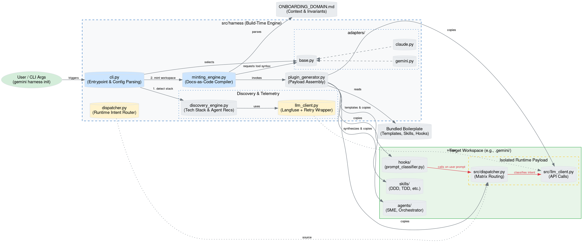

# Agentic Harness Architecture

This document provides a visual representation of the Agentic Harness architecture, illustrating how the build-time engine (`src/harness`) mints a project and deploys an isolated runtime payload to the target workspace (e.g., `.gemini/`).

## Architectural Flow

Below is the Graphviz (DOT) representation of the system. You can render this using any standard Graphviz viewer (like [WebGraphviz](http://www.webgraphviz.com/) or Edotor).

## Component Breakdown

### 1. Build-Time Engine (`src/harness`)
This is the compiler phase. It is responsible for reading the user's codebase, analyzing constraints, and minting the target environment.
- **`cli.py`**: The main entrypoint that orchestrates the setup phases.
- **`discovery_engine.py`**: Analyzes the tech stack and proposes specialized agents.
- **`minting_engine.py`**: Converts human-readable `ONBOARDING_DOMAIN.md` files into strict machine configurations.
- **`plugin_generator.py`**: Assembles the files, resolves templates, and writes the output.
- **`adapters/`**: Abstracts platform-specific syntax (e.g., Gemini vs. Claude subagent invocation).

### 2. Isolated Runtime Payload (Target Workspace)
During generation, the harness explicitly copies a subset of itself into the target workspace (e.g., `.gemini/src/`).
- **`dispatcher.py`**: Intercepts user prompts and performs Matrix Routing (classifying intents into Bug Fix, Feature Request, etc.).
- **`llm_client.py`**: Handles resilient API calls and telemetry (Langfuse) for the dispatcher.

This isolation ensures that the active AI environment remains lightweight and strictly decoupled from the heavy build-time parsing logic.
